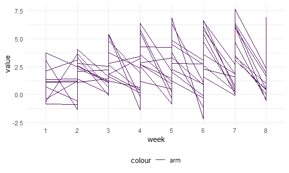

Homework 5
================
Laya Buchanan
2020-11-05

This is my submission for the fifth homework assignment for P8105.

# Problem 2: Longitudinal study data

``` r
control_exp_df = 
  map_df(list.files(path = "./data", full.names = TRUE), read.csv) %>% 
  mutate(file_name = list.files(path = "./data")) %>% 
  relocate(file_name, .before = week_1) %>% 
  separate(file_name, into = c("arm", "id"), sep = "_") %>% 
  separate(id, into = c("id", "delete"), sep = "\\.") %>% 
  select(-delete) %>% 
  mutate(arm = recode(arm, 'con' = "control")) %>% 
  mutate(arm = recode(arm, 'exp' = "experimental"))
  

control_exp_df %>% 
  pivot_longer(
    week_1:week_8,
    names_to = "week",
    names_prefix = "week_",
    values_to = "value"
    ) %>% 
  ggplot(aes(x = week, y = value, group = id, color = "arm")) + 
  geom_line()
```


