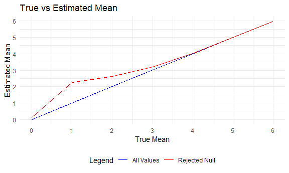

Homework 5
================
Laya Buchanan
2020-11-05

This is my submission for the fifth homework assignment for P8105.

# Problem 2: Longitudinal study data

First, I created a tidy dataframe containing data from all participants,
including the subject ID, arm, and observations over time from the
original folder of .csv files.

``` r
control_exp_df = 
  map_df(list.files(path = "./data", full.names = TRUE), read.csv) %>% 
  mutate(file_name = list.files(path = "./data")) %>% 
  relocate(file_name, .before = week_1) %>% 
  separate(file_name, into = c("arm", "id"), sep = "_") %>% 
  separate(id, into = c("id", "delete"), sep = "\\.") %>% 
  select(-delete) %>% 
  mutate(arm = recode(arm, 'con' = "control")) %>% 
  mutate(arm = recode(arm, 'exp' = "experimental"))
```

Then, I made a spaghetti plot showing observations on each subject over
time by week.

``` r
control_exp_df %>% 
  pivot_longer(
    week_1:week_8,
    names_to = "week",
    names_prefix = "week_",
    values_to = "value"
    ) %>% 
  unite(group, arm:id, sep = '', remove = FALSE) %>% 
  ggplot(aes(x = week, y = value, group = group, color = arm)) + 
  geom_line() + 
  labs(
    title = "Measurement for Control vs Experimental Arm Over Time",
    x = "Week",
    y = "Value") +
   theme(legend.position = "right")
```


While measurements for the variable of interests were comparable at
baseline for the control and experimental groups, values increased over
time for the experimental group, but not for the control group. There
was considerable inter- and intra-individual variability in both groups.

# Problem 3: Power

``` r
sim_t_test = function(n = 30, mu, sigma = 5) {
  
  sim_data = tibble(
    x = rnorm(n, mean = mu, sd = sigma)
  )
  
    sim_data %>% 
      t.test(
      mu = 0,
      conf.level = 0.95) %>% 
      tidy()
  

}
```

``` r
output = vector("list", length = 5000)

for (i in 1:5000) {
  
  output[[i]] = sim_t_test(mu = 0)
  
}

bind_rows(output)
```

    ## # A tibble: 5,000 x 8
    ##    estimate statistic p.value parameter conf.low conf.high method    alternative
    ##       <dbl>     <dbl>   <dbl>     <dbl>    <dbl>     <dbl> <chr>     <chr>      
    ##  1   -0.735    -0.895 0.378          29   -2.41      0.944 One Samp~ two.sided  
    ##  2   -0.769    -1.00  0.325          29   -2.34      0.803 One Samp~ two.sided  
    ##  3    0.813     0.962 0.344          29   -0.914     2.54  One Samp~ two.sided  
    ##  4    0.757     0.792 0.435          29   -1.20      2.71  One Samp~ two.sided  
    ##  5    0.288     0.321 0.751          29   -1.55      2.13  One Samp~ two.sided  
    ##  6    0.231     0.241 0.812          29   -1.73      2.20  One Samp~ two.sided  
    ##  7   -0.135    -0.129 0.898          29   -2.27      2.00  One Samp~ two.sided  
    ##  8    1.06      0.890 0.381          29   -1.37      3.48  One Samp~ two.sided  
    ##  9    2.29      2.88  0.00737        29    0.663     3.91  One Samp~ two.sided  
    ## 10   -0.823    -0.994 0.328          29   -2.52      0.870 One Samp~ two.sided  
    ## # ... with 4,990 more rows

``` r
mu_list = 
  list(
    "mu = 0" = 0,
    "mu = 1" = 1,
    "mu = 2" = 2,
    "mu = 3" = 3,
    "mu = 4" = 4,
    "mu = 5" = 5,
    "mu = 6" = 6
  )

for (i in 1:7) {
  output[[i]] = 
    rerun(5000, sim_t_test(mu = mu_list[[i]]))
bind_rows()
}


sim_results =
  tibble(
  mu = c(0, 1, 2, 3, 4, 5, 6)
) %>% 
  mutate(
    output_lists = map(.x = mu, ~rerun(5000, sim_t_test(mu = .x))), 
estimate_df = map(output_lists, bind_rows
  )
) %>% 
  unnest(estimate_df) %>% 
  select(mu, estimate, p.value)
```

``` r
sim_results %>% 
  mutate(
    reject_null = p.value < 0.05
  ) %>% 
  group_by(mu) %>% 
  count(reject_null) %>% 
  filter(reject_null == TRUE) %>% 
  mutate(
    prop_reject = n/5000
  ) %>% 
  ggplot(aes(x = mu, y = prop_reject)) +
  geom_line() + geom_point() +
  labs(
    title = "Power",
    x = "True Mean",
    y = "% of Times Null Rejected") +
    scale_y_continuous(
    breaks = c(0.25, 0.50, .75, 1.00), 
    labels = c(25, 50, 75, 100)) +
  scale_x_continuous(
    breaks = c(0, 1, 2, 3, 4, 5, 6))
```


